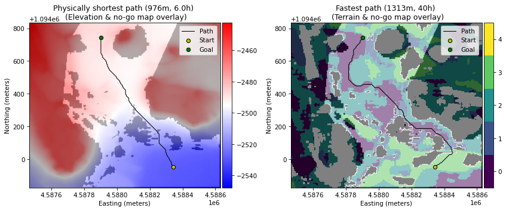
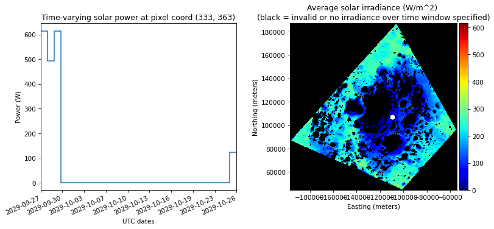

# gplanetary-nav

Python-based interface with georeferenced terrain and insolation maps of planetary surfaces, in support of global navigation planning.

If this library is useful to your work, awesome! Please [cite it](#citation) accordingly.

**Author**: Olivier Lamarre  
**Affiliation**: [STARS Laboratory](www.starslab.ca), University of Toronto  

## Overview

This library provides basic functionalities for queries involving terrain and
insolation maps in support of global navigation planning on planetary surfaces.

| *Optimal grid-based path planning on maps of Jezero Crater, Mars* |
| :-: |
| |

| *Estimated solar power generation time series in Cabeus Crater, Moon* |
| :-: |
||

Functionalities currently implemented:

- Load and visualize terrain maps of a planetary surface (elevation, slope, aspect, terrain type, etc.) and solar irradiance maps corresponding to different timestamps.
- Create your own random terrain maps, if needed.
- Generate planning graphs at the same spatial resolution as the terrain/insolation maps (1 vertex for every map pixel) and encode relevant mobility information in every edge (rover pitch/roll, edge length, traverse duration, energy consumption, and more).
- Graph-based optimal path planning. Objective functions include:
    - Physically shortest path;
    - Fastest path (possibility to implement custom rover velocity model);
    - Lowest energy expenditure path (possibility to implement custom rover mobility power consumption model).
- Given a simplified solar power model (which assumes a solar array on a pan/tilt mechanism, maintaining perfect alignment with sunlight), estimate instantaneous solar power generation and solar energy generated over a time interval.


## Package setup / installation

This project is developed using Python 3.7 and conda ([Miniconda3](https://docs.conda.io/en/latest/miniconda.html) tested). Although not required, using [mamba](https://mamba.readthedocs.io/en/latest/installation.html) significantly speeds up the installation process and requires much less memory (if you are using it, replace `conda` with `mamba` in the commands below).

Once conda is installed, clone the repository on your machine. Create the conda environment and install the core dependencies. By default, the environment name is `gplanetary-nav`. You can provide your own environment name by passing a `-n <env-name>` argument:

```sh
conda env create -f environment.core.yaml
```

To use jupyter notebooks (such as those from the quick start guide), update the environment with additional dependencies:

```sh
conda env update -f environment.local.yaml
```

Activate the environment:

```sh
conda activate gplanetary-nav # replace with your env name if needed
```

## Getting started

See the repository's [wiki](https://github.com/utiasSTARS/gplanetary-nav/wiki) for a step-by-step usage guide. We show examples involving simple datasets of specific sites on the Lunar and Martian surfaces. We also explain how to format your own dataset to make it compatible with the library.
## Repository structure

The source code of the library is located in `gplanetary_nav/`. All other top-level directories or files are used for project setup or development purposes:

- **config/** : repository configuration (directory paths and logging).

- **data/** : default directory where data products are saved. All files in this directory are git-ignored.

- **docs/**: all documentation-related content (images/figures, tutorial jupyter notebooks, etc.)

- **logs/** : default location where all logs are created. They are all ignored by git & can be safely deleted anytime. Logging configuration is located in the [config](config) directory.

## License

[MIT License](LICENSE)

## Citation

O. Lamarre, S. Malhotra, J. Kelly, Recovery Policies for Safe Exploration of Lunar Permanently Shadowed Regions by a Solar-Powered Rover, Acta Astronautica (submitted 2023).

bibtex:

```
@article{2023_Lamarre_Recovery,
  author = {Olivier Lamarre and Shantanu Malhotra and Jonathan Kelly},
  doi = {10.1016/j.actaastro.2023.09.028},
  journal = {Acta Astronautica},
  month = {December},
  pages = {706--724},
  site = {https://papers.starslab.ca/recovery-policies-psr-exploration/},
  title = {Recovery Policies for Safe Exploration of Lunar Permanently Shadowed Regions by a Solar-Powered Rover},
  url = {https://arxiv.org/abs/2307.16786},
  volume = {213},
  year = {2023}
}
```
